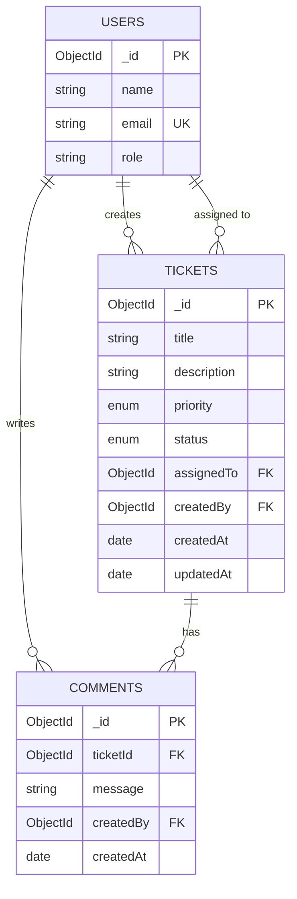

# Data Model

## Entity Relationship Diagram



## Collections (MongoDB)

Mongoose models live in `backend/src/models/`. Initialization scripts in `database/`.

### users (seeded only in Core)

| Field | Type | Constraints |
|-------|------|-------------|
| `_id` | ObjectId | Auto-generated |
| `name` | String | Required, max 100 chars |
| `email` | String | Required, unique |
| `role` | String | Required, default `'agent'` |

No password field in Core (no authentication).

---

### tickets

| Field | Type | Constraints |
|-------|------|-------------|
| `_id` | ObjectId | Auto-generated |
| `title` | String | Required, max 200 chars |
| `description` | String | Optional |
| `priority` | String | Required, default `'medium'` |
| `status` | String | Required, default `'open'` |
| `assignedTo` | ObjectId | Ref → `User`, optional |
| `createdBy` | ObjectId | Ref → `User`, required |
| `createdAt` | Date | Auto, default `Date.now` |
| `updatedAt` | Date | Auto, default `Date.now` |

**Indexes:** `status`, `createdBy`, `assignedTo`, text index on `title` + `description` (for keyword search)

**Enums (enforced in Mongoose schema + service layer):**
- `priority`: `low`, `medium`, `high`, `critical`
- `status`: `open`, `in_progress`, `resolved`, `closed`, `cancelled`

---

### comments

| Field | Type | Constraints |
|-------|------|-------------|
| `_id` | ObjectId | Auto-generated |
| `ticketId` | ObjectId | Ref → `Ticket`, required |
| `message` | String | Required |
| `createdBy` | ObjectId | Ref → `User`, required |
| `createdAt` | Date | Auto, default `Date.now` |

**Indexes:** `ticketId`

## API ID Format

MongoDB `_id` values are exposed in the API as strings (e.g. `"507f1f77bcf86cd799439011"`). The backend validates ObjectId format on incoming IDs.

## Status State Machine

```
open ──► in_progress ──► resolved ──► closed
  │           │
  └──► cancelled ◄──┘
```

Terminal states: `closed`, `cancelled` — no further transitions.

State machine rules are enforced in the **service layer** (MongoDB does not enforce transitions at the database level).

## Seed Data

Seed at least:
- 3 users (mix of roles)
- 3–5 tickets in various statuses
- 2–3 comments on at least one ticket

Run: `npm run seed` from `backend/` (see `database/setup-notes.md`).

Seed script: `database/seed.js`
